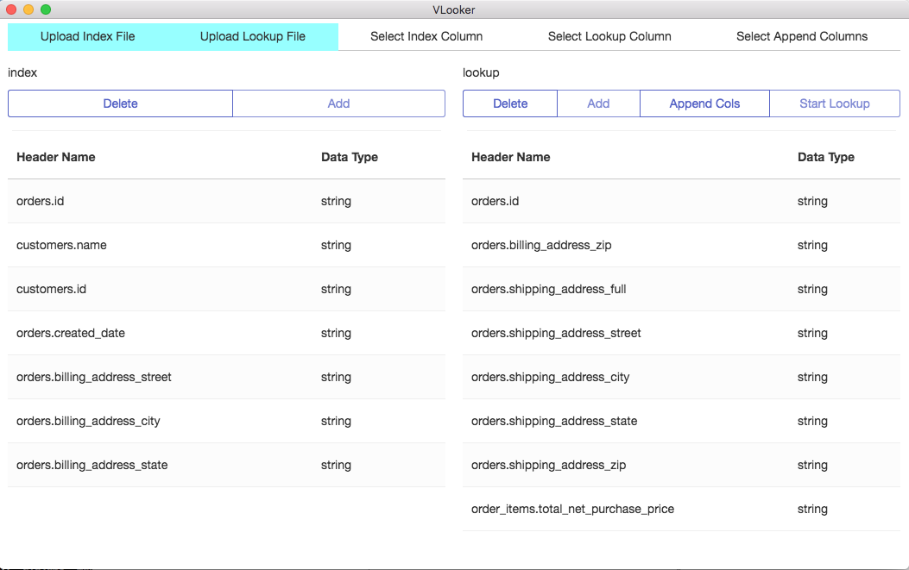

VLooker
==============

A Desktop App for VLookups

## What This Project is

This project exists because Microsoft Excel is a high load program especially when it is running VLOOKUPs, which tended to be the majority of the work that I did at work. This small scope project wraps some JS scripts that I wrote around a GUI. Right now it only handles CSV files. 

VLooker is written on [Electron](electron.atom.io) and uses as a dependency [csv.js](https://github.com/knrz/CSV.js/) and jQuery. 

Right now I don't have releases for Linux or Windows. I'll have to add that later. 

## Features

- VLookups
- That's about it (though I'd like to add more)

## How to Install 

### OS X

1. Download [VLooker-v0.1.0-darwin-x64.dmg](./releases/VLooker-v0.1.0-darwin-x64.dmg)
2. Open or unzip the file and drag the app into the `Applications` folder
3. Done.

## How to Use

A VLookup query takes several inputs: 

- Index sheet (the sheet you want to append information to)
- Lookup sheet (the sheet with the information you want looked up and appended)
- The Index column (the column to look for)
- The Lookup column (the column to search for the Index)
- Appended Columns (Taken from the Lookup sheet and affixed to the Index, multiples allowed)

Uploading a CSV displays the headers and you can select from there the appropriate data points. Most of it is straightforward. The only challenging thing is selecting the appended columns, you can activate a "Column Append Mode" on the Lookup side of VLooker and use that to select the relevant columns to append. 

